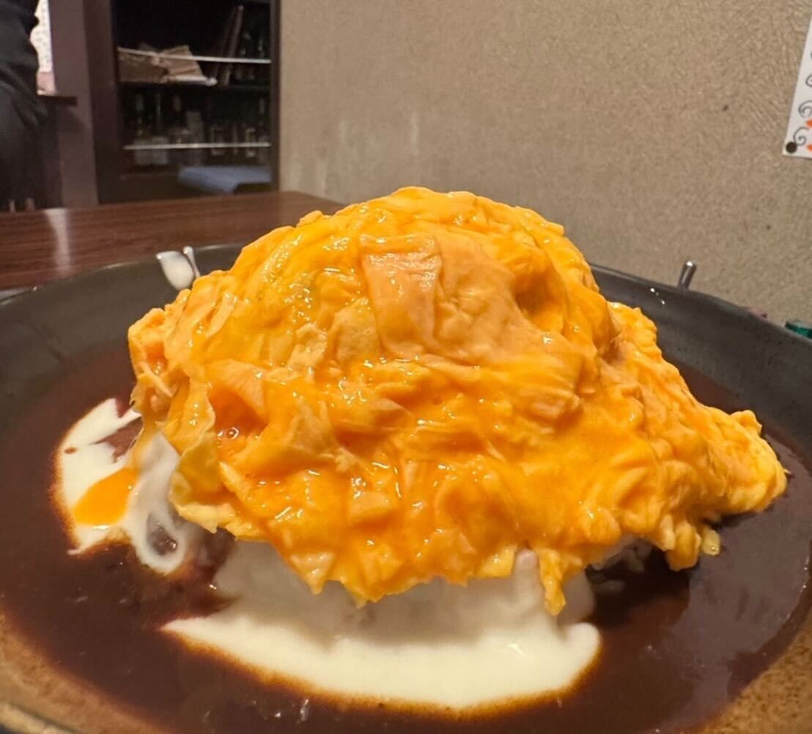
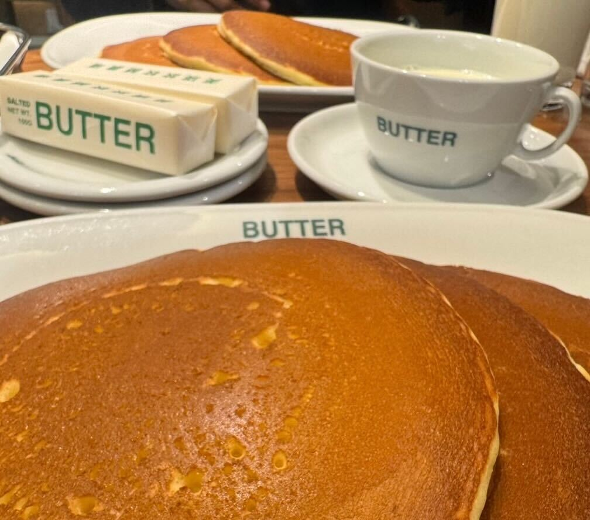
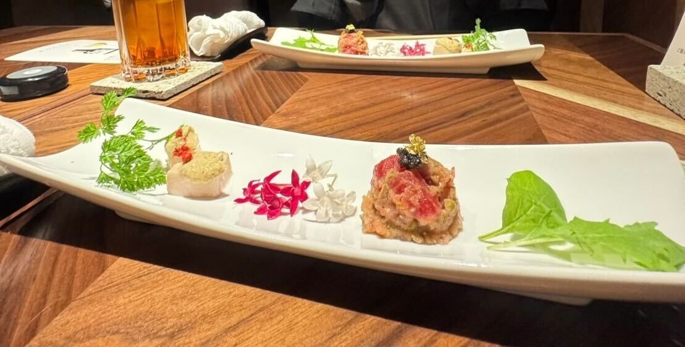
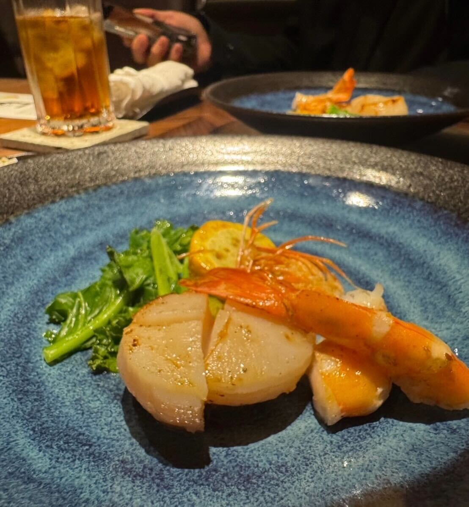
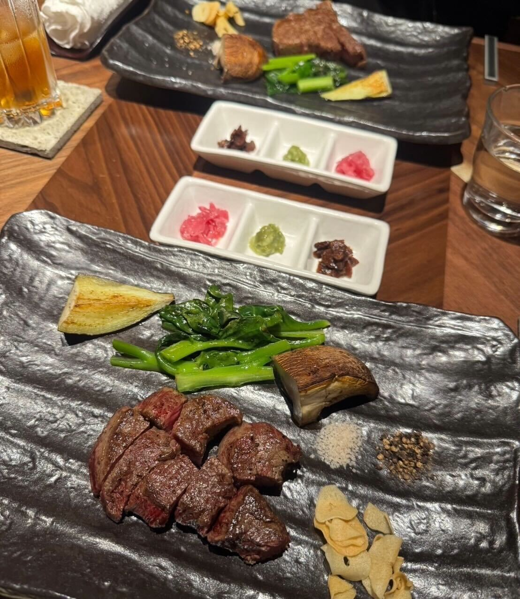

## ふわとろ卵と鉄板の香ばしいジューシーハンバーグ！めぐろの絶品デミオムハンバーグ

東京グルメ旅一件目は「鉄板処 めぐろ」です。\
店内は少し暗めの落ち着いた雰囲気で、\
まわりにはランチに来ている会社員の方が多く、どこかゆったりした空気が流れています。

そんな「めぐろ」さんで注文したのは、ランチ限定の「デミオムハンバーグ」。\
料理が運ばれてくると、ふんわりとしたオムレツがハンバーグの上にのった、ボリュームのある一皿が登場します。\
ここで店員さんが目の前でオムレツを割ってくれて、\
とろとろの卵が広がり、全体をやさしく包み込んでいきます。

中には鉄板で焼かれた牛肉ハンバーグが入っていて、\
食べるたびにしっかりした旨みが感じられます。\
まわりにはコクのあるデミグラスソースと、まろやかなホワイトソースがかかっていて、\
ふたつのソースが自然に混ざり合うことで、とても深みのある味わいになっていました。

落ち着いた空間で味わう、満足度の高い一皿でした。

===店舗情報===\
店名: 鉄板処 めぐろ\
リンク: [公式ウェブサイト](https://meguro-teppan.com/)\
住所: 東京都中央区銀座8-5-18 サンウッドビル 2F

## 丸ごと一つのミルキーなバターがたまらない！絶品ホットケーキ

おやつを食べに「BUTTER」に訪れました。\
注文したのは、バターが丸ごとひとつ添えられたホットケーキです。

やさしくて素朴な味わいのホットケーキに、できたてのふわふわバターがすっと溶けていきます。\
バターはとてもミルキーで、「ミルクを食べるバター」と呼ばれているのも納得の風味でした。

余ったバターは持ち帰り用に包んでもらえるので、無理に使い切らなくても大丈夫。\
自分の好みのバランスで楽しめました。

ホットケーキ以外にも、チーズトーストなど気になるメニューがいくつかあったので、次回はそちらも試してみたいです。

===店舗情報===\
店名: BUTTER 美瑛放牧酪農場\
リンク: [公式ウェブサイト](https://biei-farm.co.jp/butter/)\
住所: 東京都千代田区丸の内２丁目４−１ 丸の内ビルディング B1

## クラシックで贅沢なフルコース！鉄板焼き「KITAZUMI」

夕食は「KITAZUMI」へ訪れました。\
店内はとても優雅で落ち着いた雰囲気です。\
店主の方が鉄板の上で丁寧に食材を焼き上げる姿はかっこよくて自然と目がいきます。\

席につくと、予約していたコース料理が順番に運ばれてきました。

画像一枚目は前菜です。\
季節の花や葉が添えられた一皿で、やさしい味わいの前菜でした。\
見た目はとても華やかで、運ばれてきた瞬間からこの先の料理が楽しみになるような一皿です。

画像二枚目は天使エビとホタテの鉄板焼きです。\
ここで鉄板ならではの香りが一気に広がり、コースの雰囲気がぐっと変わります。\
肉厚でクリーミーなホタテと、香ばしく焼き上げられた天使エビはどちらも存在感があり、\
このコースの中でも印象に残る一皿でした。

そして三枚目は黒毛和牛のステーキです。\
今回はシャトーブリアンとヒレの二種類をそれぞれ注文しました。

シャトーブリアンはとろけるような口当たりで、脂の甘みと肉の旨みがしっかり感じられます。\
ヒレはお肉らしい力強さがあり、噛むほどに旨みが広がる味わいでした。

どちらもほどよい火通りで、鉄板で丁寧に仕上げられた香りがお肉の良さをやさしく引き立てていました。

一皿ごとの完成度はさることながら、コース全体を通してずっとワクワクしながら楽しめました。\
鉄板で仕上げてくれる様子もとてもかっこよくて、落ち着いた店内の雰囲気ともよく合っていました。\
最後まで飽きずに楽しめる、素敵な時間でした。

===店舗情報===\
店名: 鉄板 日本橋 KITAZUMI\
リンク: [公式ウェブサイト](https://nihonbasshi-kitazumi.owst.jp/)\
住所: 東京都中央区日本橋2-15-9 日本橋TSビル 1F\
