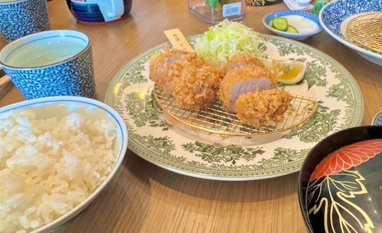
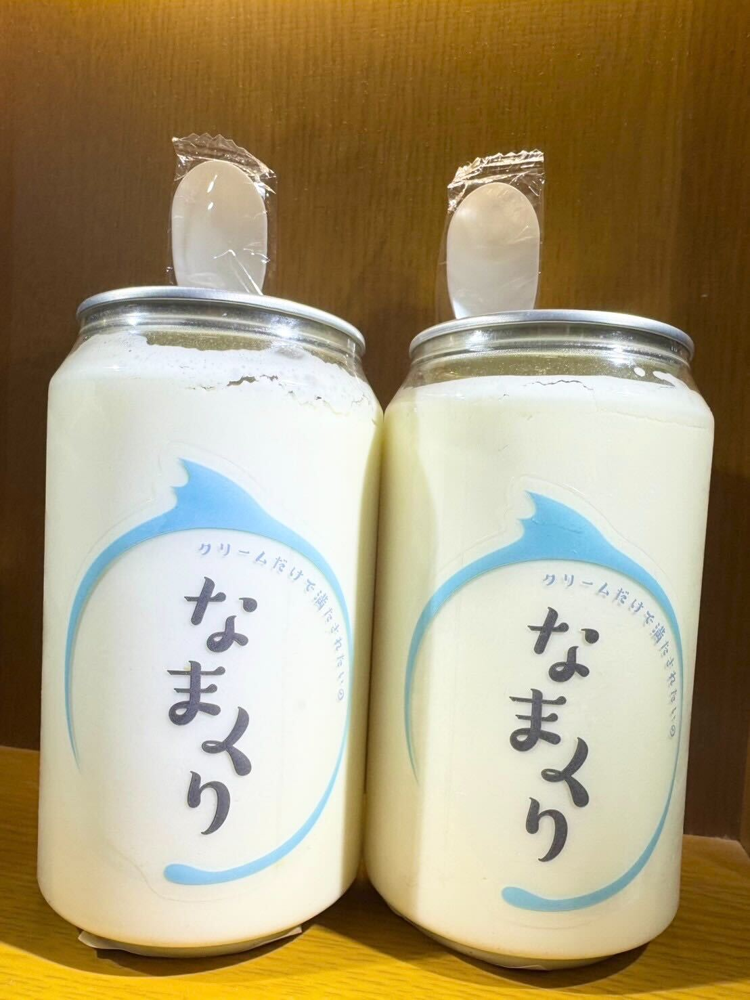
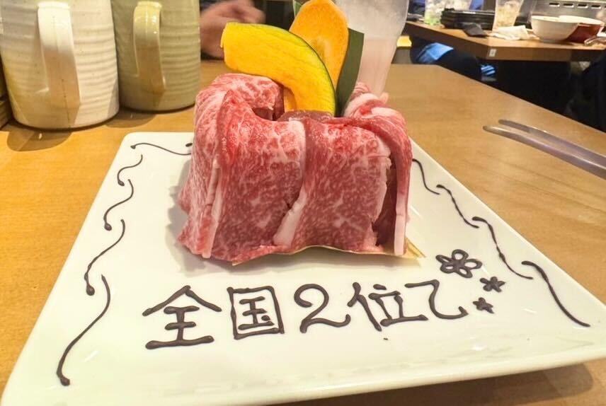

## ミシュランシェフの手掛けるとんかつ専門店！お塩でいただく絶品とんかつ

東京グルメ旅二日目。\
ランチに訪れたのは、ミシュランシェフが手がけるとんかつ専門店「あきら」です。\
鹿児島の黒豚「アベル黒豚」を使ったヒレカツとリブロースカツをいただきました。

衣は軽めで、お塩でいただくとお肉の味がよりしっかり感じられて好みでした。\
テーブルに置かれている卵はおかわり自由で、卵かけごはんと一緒にとんかつを楽しめるのも嬉しいポイントです。

店内は明るくて、気軽に楽しめる雰囲気。\
ランチにぴったりの素敵なお店でした。

===店舗情報===\
店名: とんかつ あきら\
リンク: [公式ウェブサイト](https://www.instagram.com/tonkatsu_akira/)\
住所: 東京都渋谷区道玄坂2-20-3 モンテ道玄坂 1F

## 贅沢に生クリームをしようした話題のスイーツ！「なまくり」

おやつにいただいたのは、缶の90％が生クリームで作られているというスイーツ「なまくり」。\
新宿パルコ内にある自販機で購入しました。

見た目のインパクトに反してくどさはなくて、\
軽い口当たりで最後までおいしく食べられました。

===店舗情報===\
店名: スイーツ缶 なまくり\
リンク: [公式ウェブサイト](https://namakuri.base.shop/)\

## おいしいお肉が食べ放題！「肉屋の台所」

晩ごはんは肉屋の台所で焼肉をいただきました。\
特に印象的だったのが、画像のお肉ケーキ！\
メッセージを添えて提供してくれて、ちょっとしたお祝いにもぴったりの一皿でした。\
お肉が何層にも重なっていて、食べ進めるごとに違う部位が出現！\
ワクワクしながら食べ進めていけます♪

===店舗情報===\
店名: 和牛焼肉食べ放題 肉屋の台所\
リンク: [公式ウェブサイト](https://nikuyanodaidokoro.com/)\
住所: 東京都渋谷区渋谷１-25-6　パークサイド共同ビル5F\
