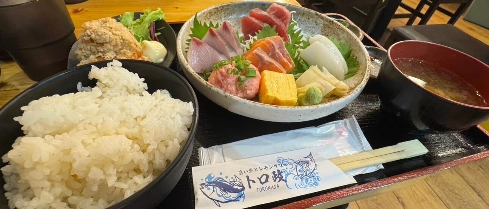

## ボリューム満点！大満足の定食！「トロ政」

二日目のランチは「トロ政」でいただきました。\
ルーレットで止まった駅に降りて、ぶらぶら歩きながらお店を探している中で出会ったお店です。

注文した定食は想像以上のボリュームがあってびっくり。\
副菜から主菜までどれもおいしくて、偶然の出会いに感謝したくなるランチでした。

===店舗情報===\
店名: トロ政 赤坂見附店\
リンク: [公式ウェブサイト](https://gjfw001.gorp.jp/)\
住所: 東京都港区赤坂3-20-8 臨水ビル1F

## 浅草食べ歩きで至福のひととき！わらび餅に浅草メンチ

### わらび餅

浅草で立ち寄ったお店で、わらび餅をいただきました。\
やわらかくてとろっとした食感で、きなこの香りがふわっと広がります。\
歩き疲れたところにちょうどよく、いいおやつタイムになりました。

### 浅草メンチ

浅草に来たら食べたくなる「浅草メンチ」も購入。\
衣はサクッとしていて、中はジューシー。\
シンプルだけどしっかり旨みがあって、小腹を満たすのにぴったりでした。

===店舗情報===\
店名: 浅草メンチ\
リンク: [公式ウェブサイト](https://asamen.com/)\
住所: 東京都台東区浅草2丁目3-3\
