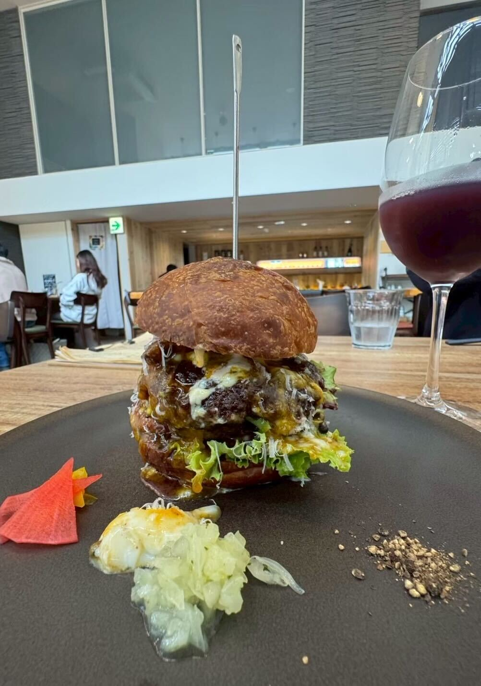
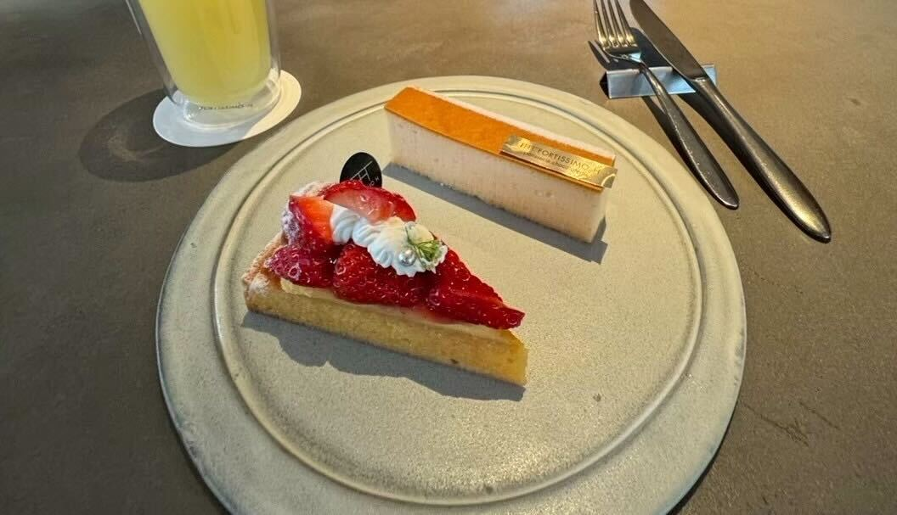
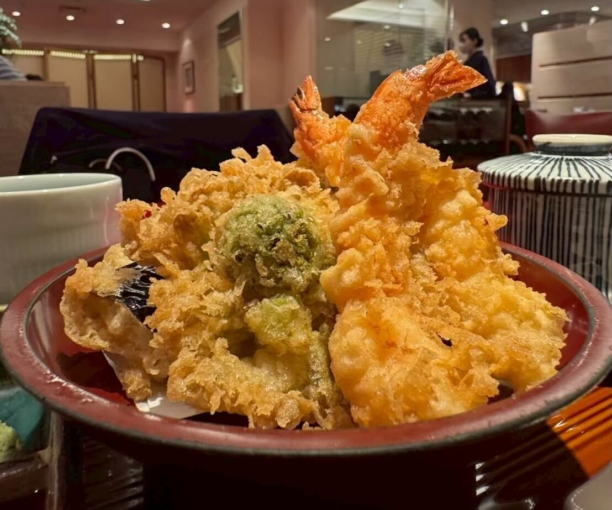

## もう二度と味わえない！？絶品カルボナーラハンバーガー

本日は名古屋グルメ旅です。\
まずランチを食べに一軒目に向かったのは、ハンバーガーのおいしいお店「Local」さん！

画像はカルボナーラハンバーガーです。\
ジューシーなパティにクリーミーなソースがよく合って、クセになるおいしさでした。

メニューも豊富で、ほかのハンバーガーも気になっていたのですが、\
残念ながら2025年9月末で閉店されたとのこと。\
もうこの味に出会えないと思うと少し寂しい気持ちになります。

ただ、店主の方は新しくイタリア料理のお店を始められるようなので、\
名古屋に行く際はそちらにもぜひ伺ってみたいです♪

===店舗情報===\
店名: Local\
新店舗: osteria vanna\
新店舗リンク: [公式インスタグラム](https://www.instagram.com/osteria_vanna/)\
住所: 名古屋市中村区名駅3-5-14 地下1階

## 上品で優雅なアフターヌーンティーに最適♪「FORTISSIMO H」

続いておやつに向かったのは「FORTISSIMO H」さん。\
どのケーキも上品な甘さで、いくつ食べても飽きのこない味わいでした。

特にいちごのタルトは、フルーティな果肉とサクッとほろっとしたタルト生地がよく合っていて、ひと口ごとに幸せな気分になります。

名古屋に来た際には、ぜひまた立ち寄りたいお店です♪

===店舗情報===\
店名: FORTISSIMO H\
リンク: [公式ウェブサイト](http://www.fortissimo-h.jp/)\
住所: 愛知県名古屋市千種区高見2-1-16 名古屋セントラルガーデン

## サクっ！ジュワっ！が堪らない！天一の絶品天ぷら

夕食は天ぷらが食べたくなり、急遽「天一」さんへ訪れました。\
今回はテーブル席でしたが、カウンターでは目の前で揚げたての天ぷらが提供されてました。\
次に行くときは、ぜひカウンターでいただいてみたいです。

注文したのは天丼と、別で車エビの天ぷら。\
天丼は、甘めの醤油だれが揚げたての天ぷらによくからんでいて、とても満足のいく味わいでした。\
単品で頼んだ車エビの天ぷらも、軽い衣で塩との相性がよく、おいしくいただけました。

どちらも最後までおいしくて、良い夕食になりました。

===店舗情報===\
店名: 銀座 天一 名古屋名鉄店\
リンク: [公式ウェブサイト](https://tenichi.co.jp/)\
住所: 愛知県名古屋市中村区名駅1-2-1 名鉄百貨店本店 9F\
