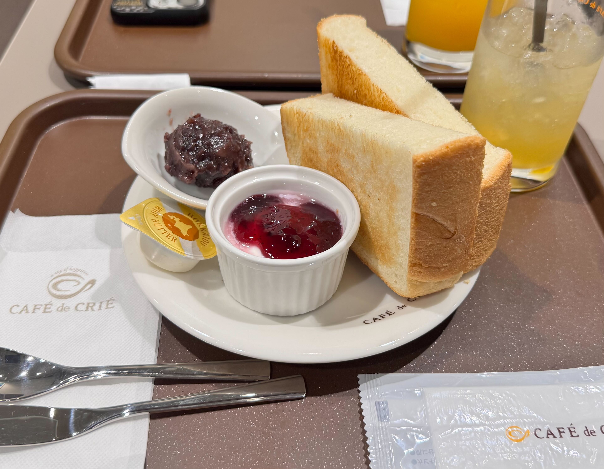
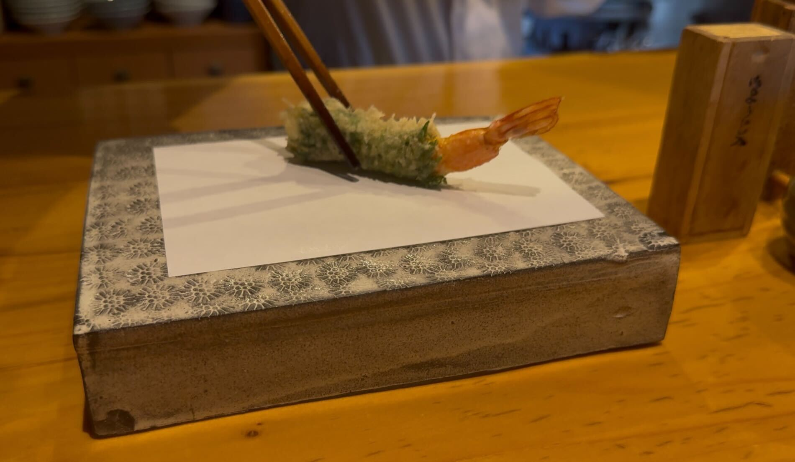

## 名古屋でいただくモーニング

今回の名古屋グルメ旅は、あえて少し早めに到着して、まずはモーニングからスタート。\
訪れたのは名古屋駅から歩いてすぐの「Cafe de CRIE」さんです。\
分厚めの焼き立てトーストを小倉マーガリンで頂きます。\
朝にちょうどいいやさしい甘さでした。

===店舗情報===\
店名: CAFE de CRIE\
リンク: [公式ウェブサイト](https://c-united.co.jp/crie/)\
住所: 愛知県名古屋市中村区椿町15-2 名古屋ミタニビル 1F

## 上質な食材を職人がていねいに揚げる、コスパ最強の天ぷらランチ

ランチに訪れたのは、天ぷら「よこい」さん。\
穏やかな旦那様と、明るい雰囲気の奥様が営む、温かみのあるお店です。

カウンターで待っていると、アツアツ揚げたての天ぷらが次々と目の前に置かれていきます。\
薄くて軽い衣に包まれた食材、素材の良さがそのまま伝わってくるような一品ばかりです。

それぞれの天ぷらに合わせて、お塩や大根おろし入りのつけ汁など、食べ方が丁寧に案内されるのも印象的でした。\
炊きたてのお米と天ぷらの香り、そして食材の旨みが合わさって、ひと口ごとに満足感があります。

これだけ贅沢な天ぷらをたくさんいただけて、料金は2500円。コスパ最強の天ぷらランチでした。

ぜひまた訪れたいお店で、次はディナーでも伺ってみたいです。

===店舗情報===\
店名: 天ぷら よこい\
リンク: [食べログページ](https://tabelog.com/aichi/A2301/A230114/23006034/)\
住所: 愛知県名古屋市守山区幸心1-1319

## 炭火で香ばしい！ジュワっと広がる鶏の旨み！「備長扇屋」

夕飯は「備長扇屋」へ。\
こちらは地元・浜松でもよく訪れる焼き鳥チェーンで、旅先でも同じ味が楽しめるのが嬉しいお店です。

焼き鳥は中まできちんと火が通っていて、\
表面はカラっと中には旨味が閉じこもっておりジューシーな味わいです。\
特にもも串は一本110円とは思えない満足感。\
炭火で焼かれた香ばしさがふわっと広がって、つい何本も食べたくなるおいしさでした。

旅先でいつもの味に出会えたことで、どこか安心感のある夕食になりました。

===店舗情報===\
店名: 総本家備長扇屋 名古屋本店\
リンク: [公式ウェブサイト](https://www.via-hd.co.jp/brand/ohgiya/)\
住所: 愛知県名古屋市中村区名駅3-15-8 名駅グルメプラザ 1F\
