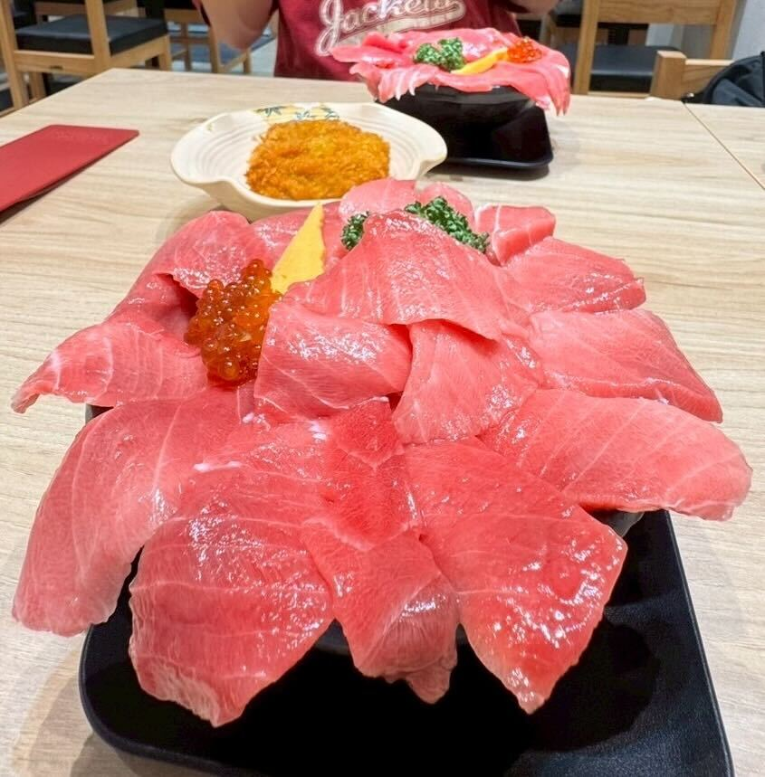
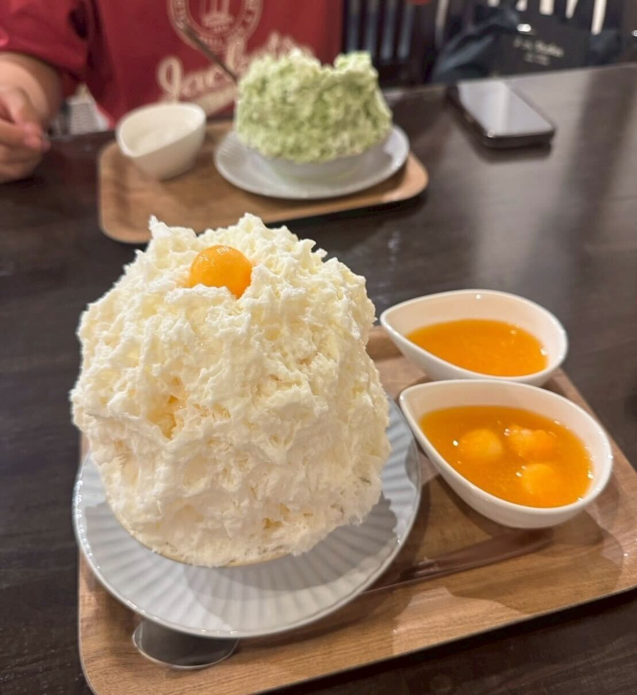
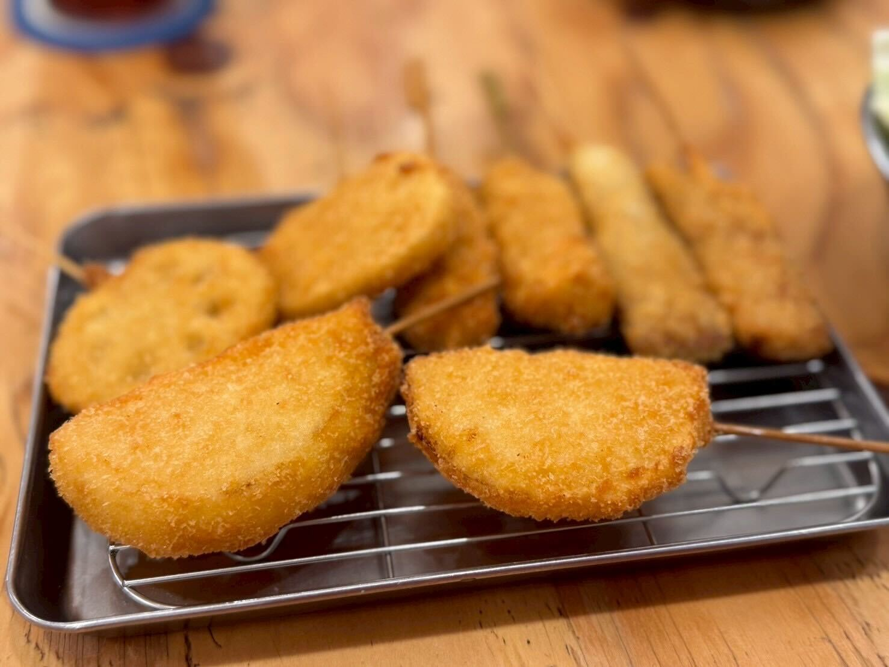

## 脂ののった中トロが丼いっぱいに敷き詰められた究極の一杯！「まぐろ王国」

本日は清水グルメ旅です。\
朝早くに家を出て、電車で約一時間。\
開店と同時に訪れたのが、清水港すぐ近くにある「まぐろ王国」さんです。

こちらでは、中トロが丼いっぱいに敷き詰められた中トロ丼を注文。\
漁港のすぐそばということもあって、とても新鮮で脂のりも抜群でした。

さらに、マグロのあらでとったお味噌汁やマグロカツなどは食べ放題。\
中トロ丼を味わいながら、食べ放題のメニューを取りに行っては楽しむという、朝からちょっと忙しくて、でも幸せな時間でした。

===店舗情報===\
店名: まぐろ王国大ちゃん\
リンク: [公式ウェブサイト](https://kashinoichi.com/maguro01_content/page07/)\
住所: 静岡県静岡市清水区島崎町149 まぐろ館 1F

## 風月花

おやつに訪れたのは、天然氷を使ったかき氷のお店「風月花」さん。\
天然氷ならではのやわらかい口どけで、シロップがしっとり染み込んだ氷がすっと溶けていきます。\
冷たい氷が体の中から涼しくしてくれるようで、夏のひと休みにぴったりでした。

トッピングも選べて、お餅のソースはとろっとした食感が新鮮でとてもおいしかったです。\
最後まで大満足のかき氷でした。

===店舗情報===\
店名: 風月花 (FU-GETSUKA)\
リンク: [公式インスタグラム](https://www.instagram.com/newfuugetsuka/)\
住所: 静岡県静岡市葵区鷹匠1-12-12

## 串カツ田中

晩ごはんは浜松に戻ってきて、行きつけの「串カツ田中」へ。\
薄めの衣で食材の旨みをしっかり包み込んだ串カツは、いつ食べても大満足のおいしさです。

旅の締めくくりに、いつもの味にほっとできる時間でした。

===店舗情報===\
店名: 串カツ田中\
リンク: [公式ウェブサイト](https://kushi-tanaka.com/)\
住所: 静岡県浜松市中央区千歳町74-2\
