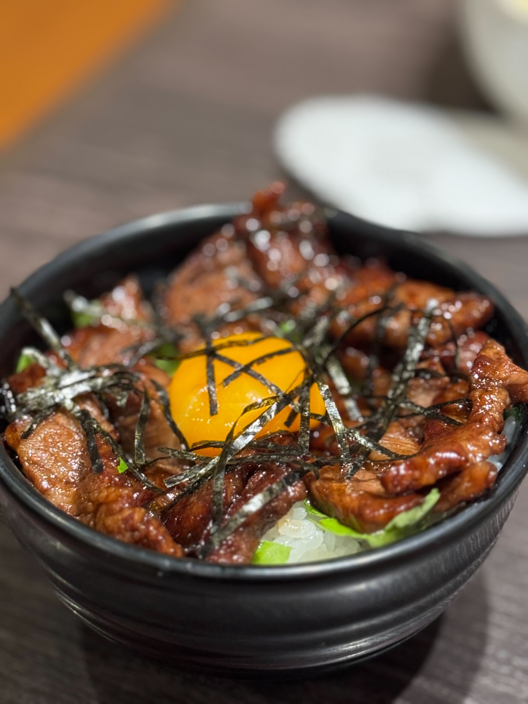

## 高塚でいただく絶品焼き肉！「ふじひろ」

本日は、前回すき焼きがおいしかった「ふじひろ」さんへ、焼肉を食べに訪れました。\
まず注文したのは、画像のまかない丼です。\
一杯1000円もしない丼ですが、上質なお肉がたっぷりのっていて、この値段でいただけるとは思えない満足感でした。

お肉だけでなく、レタスや卵などのトッピングもバランスよく合わせられていて、丼ものとしてしっかり完成された一杯だと感じました。

そのあとは、お肉や貝をいくつか追加で注文。\
どれもジューシーで、素材の旨みや脂の甘みが広がる、とても満足度の高い夕食になりました。

===店舗情報===\
店名: 焼肉 ふじひろ\
リンク: [公式X](https://x.com/fujihiro617)\
住所: 静岡県浜松市中央区高塚町1543-1
