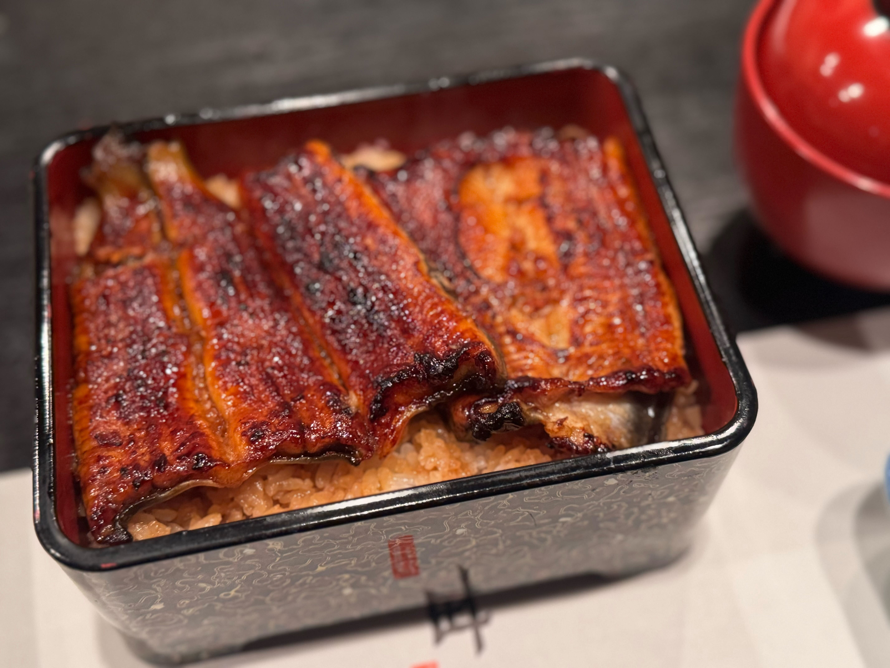
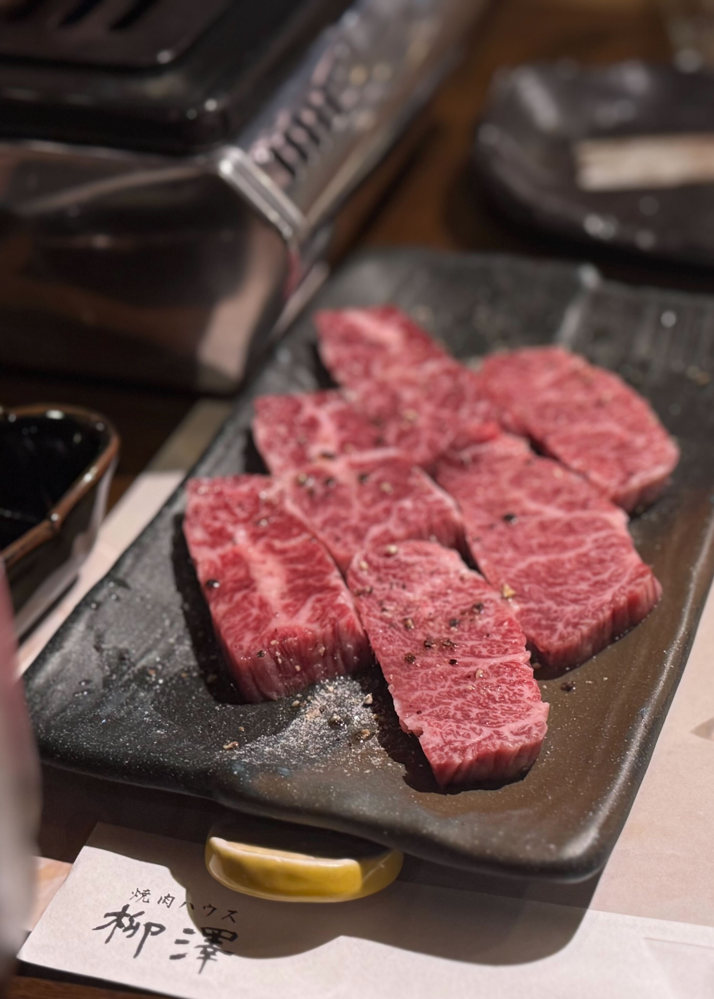

## とても上品で繊細な味わい！老舗「うなぎ藤田」でいただく絶品うな重

交流会の打ち上げに、「うなぎ藤田」さんへうなぎを食べに行きました。\
ふっくらと香ばしく焼き上げられた鰻は、余分な脂が落ちていて、秘伝のタレともよく合い、あっさりといただけます。

お店の雰囲気もとても上品で、落ち着いた空間の中でゆっくりとうなぎを楽しめました。

===店舗情報===\
店名: うなぎ藤田\
リンク: [公式ウェブサイト](https://www.unagifujita.com/)\
住所: 静岡県浜松市中央区砂山町３２２−７ ホテルソリッソ浜松 2F

## ワインにぴったりの絶品焼肉！「Calvino」

二軒目に訪れたのは「Calvino」という焼肉屋さん。
しっかりと味付けされたお肉をワインと一緒に楽しみました♪

===店舗情報===\
店名: 焼肉Calvino\
リンク: [公式ウェブサイト](https://calvino.info/)\
住所: 静岡県浜松市中央区鍛冶町319-14　有楽街アダムビル1F

## 厳選されたお肉を贅沢にいただく至福のひととき！「焼肉ハウス柳澤」

本日の締めは「焼肉ハウス柳澤」さんへ。\
こちらは雌の静岡そだちにこだわっていて、どのお肉もやわらかく、後味もすっきりしていてとても食べやすいです。

特に印象的だったのはタンすじ。\
コリッとした歯ざわりのあとに旨みがじんわり広がっていく、噛むほどにおいしい一品でした。

ほかのお肉もどれも絶品で、とろけるように口の中からすっと消えていきます。\
お腹いっぱいのはずなのに、つい次の一枚に手が伸びてしまうような焼肉でした。

締めにいただいたカレーもとてもおいしく、大満足で終えることができました。

===店舗情報===\
店名: 焼肉ハウス柳澤\
リンク: [食べログページ](https://tabelog.com/shizuoka/A2202/A220201/22018545/)\
住所: 静岡県浜松市中央区田町331-13 田町小澤ビル 3F\
