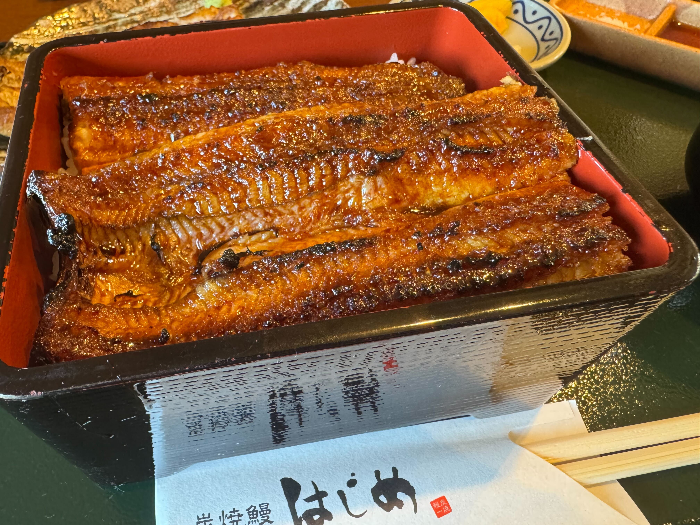
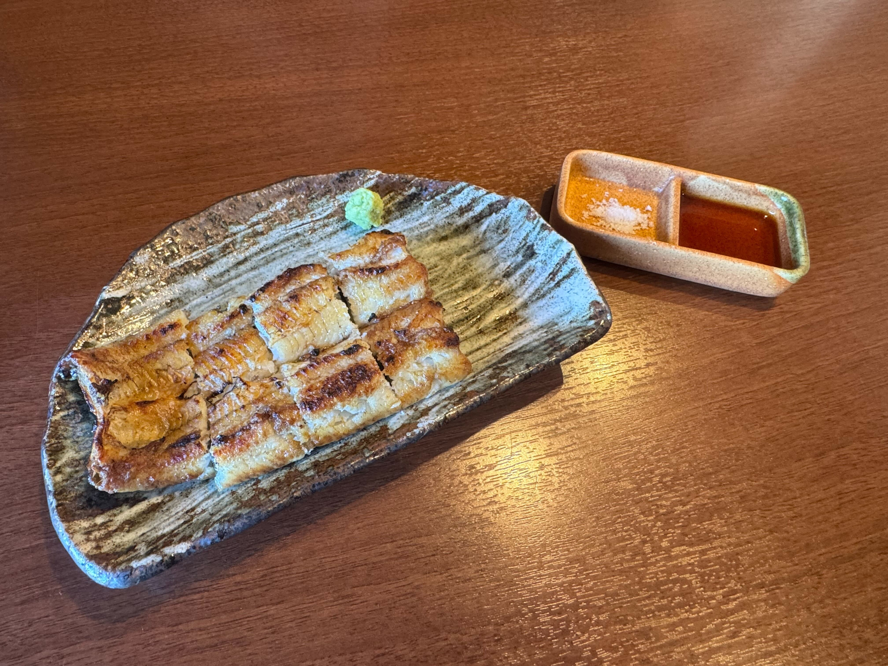

## ふっくら肉厚のうなぎを炭火でじっくり香ばしく！絶品の鰻が楽しめる「炭焼鰻 はじめ」

本日訪れたのは「はじめ」さん。\
舞阪駅からしばらく歩いた場所にあり、開店前から行列ができるほどの人気店です。\
店内は明るく、落ち着いた雰囲気でランチを楽しめました。

いただいたのは、うな重と白焼きのセットです。

こちらがうな重。\
外は香ばしく、特に尻尾のあたりはカリッとした食感で、少し新鮮なおいしさでした。\
甘さ控えめの醤油ベースのタレが、肉厚でジューシーに炭火で焼かれた鰻とよく合い、とても満足度の高い一品です。

こちらは白焼き。\
わさび醤油やわさび塩でいただきました。\
蒲焼きよりも鰻そのものの旨みがしっかり感じられて、ふわふわの身と外側のカリッとした焼き加減がすごく良かったです。

===店舗情報===\
店名: 炭焼鰻 はじめ\
リンク: [公式ウェブサイト](https://unagi-hajime.com/)\
住所: 静岡県浜松市中央区雄踏町宇布見9690
