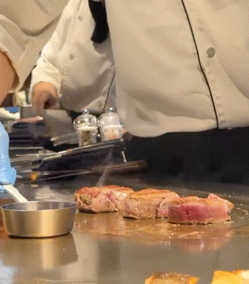
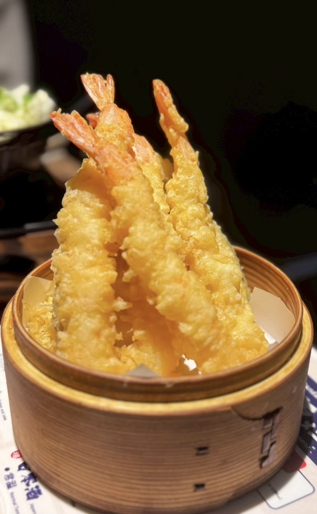

## 目の前で焼き上がるお肉と海鮮！リオの贅沢な鉄板焼きランチ

大阪グルメ旅day1。\
まずランチに訪れたのは「神戸牛 鉄板焼 リオ 大阪御堂筋店」さんです。

今回注文したのは「フィレステーキ＆シーフードランチ」。\
サラダ、海老・イカ・本日のお魚の鉄板バター焼き、フィレステーキ50g、ライス、汁物が付いた、贅沢なランチセットです。

カウンターの目の前にある大きな鉄板で、シェフが食材を一つずつ丁寧に焼き上げてくれます。\
お肉が焼ける音や香ばしい香りを間近で楽しめて、料理を待っている時間からワクワクしました。

フィレ肉は赤身が強めで、お肉そのものの味がとても濃く感じられます。\
焼き加減は好みに合わせてもらえるとのことだったので、今回はおすすめでお願いしました。

サイコロ状に食べやすく切られたお肉は、中心にきれいな赤みが残ったレアの焼き加減。\
火の入り方が絶妙で、やわらかさを楽しみながらも、噛むほどにしっかりとした肉の旨みが広がっていきます。

いろいろな薬味や味付けで楽しめましたが、個人的に一番好みだったのは山わさび。\
山わさびのさわやかな辛みが、濃いお肉の味をさらに引き立ててくれました。

セットのシーフードもどれも絶品です。\
海老やイカは鉄板で香ばしく焼き上げられていて、バターの風味との相性もぴったりでした。

特に印象に残ったのが鮭です。\
表面は香ばしく、中はふわっとやわらかくてジューシー。\
鉄板で焼き上げるからこそ感じられる香りと食感で、お肉に負けないほど満足感のある一品でした。

目の前で仕上がっていく様子も含めて楽しめる、少し贅沢なランチになりました。

===店舗情報===\
店名: 神戸牛 鉄板焼 リオ 大阪御堂筋店\
リンク: [公式ウェブサイト](https://www.dynacjapan.com/brands/rio/shops/osaka-midosuji/)\
住所: 大阪府大阪市中央区平野町4-2-3 オービック御堂筋ビル1F

## サクッと軽い衣がたまらない！米福の絶品海鮮天ぷら

夕食に訪れたのは「天ぷら寿司海鮮 米福 西梅田店」さん。\
今回は天ぷらを中心に、まぐろの天ぷらやぶりしゃぶなど、いろいろな海鮮料理をいただきました。

天ぷらは衣がとても軽く、油っぽさを感じにくい好みの食感。\
中でも特においしかったのが、画像の海老の天ぷらです。

大きな海老がたっぷり盛られていて、見た目にも迫力があります。\
サクッとした衣の中はぷりっとしていて、噛むと海老の甘みがしっかり広がりました。

今回はお塩でいただきましたが、衣の香ばしさと海老の旨みがよく引き立っていました。

まぐろの天ぷらは、お刺身でいただくときとはまた違った味わい。\
ぶりしゃぶもさっぱりしていて、天ぷらの合間にちょうどよく楽しめました。

天ぷらからお刺身、鍋料理まで、いろいろな海鮮を味わえる満足度の高い夕食になりました。

===店舗情報===\
店名: 天ぷら寿司海鮮 米福 西梅田店\
リンク: [公式ウェブサイト](https://komefuku-nishiumeda.owst.jp/)\
住所: 大阪府大阪市北区堂島1-5-17 堂島グランドビル1F