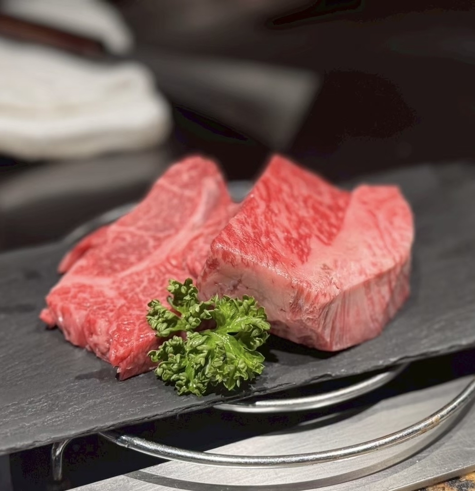
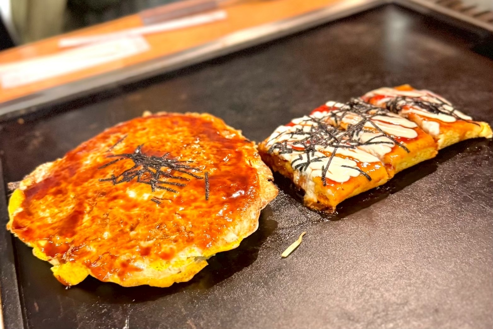
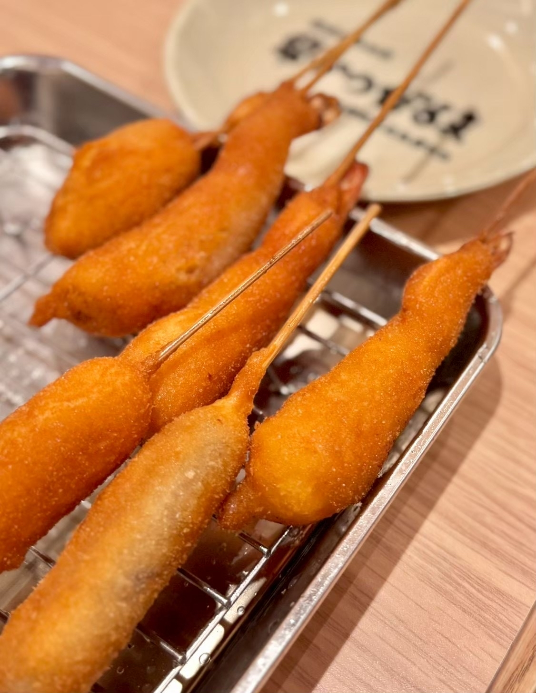
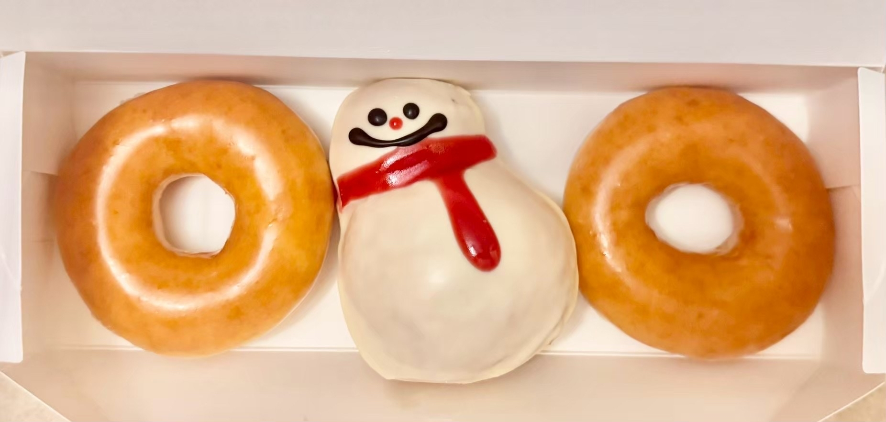

## 二種類の黒毛和牛を食べ比べ！福寿館の贅沢なステーキランチ

大阪グルメ旅day2。\
ランチに訪れたのは「福寿館 大阪なんば店」さんです。

今回注文したのは「黒毛和牛ステーキランチ」。\
本日のスープと焼野菜、約100gの黒毛和牛ステーキ、ご飯、赤だし、香の物、デザート、食後の飲み物まで付いた、コースのようなランチです。

まずは目の前の鉄板で、いろいろな種類の野菜を丁寧に焼き上げてくれます。\
野菜ごとに異なる食感や甘みを楽しめて、お肉が登場する前から満足感がありました。

そしてメインは、二種類の黒毛和牛ステーキ。\
焼き加減はおすすめでお願いしました。

お肉は中心にきれいな赤みを残したレアの状態で、サイコロ状にカットして提供されます。\
二種類それぞれに脂の入り方や食感の違いがあり、食べ比べながら楽しめました。

今回はシンプルにお塩でいただきました。\
余計な味付けがない分、お肉の濃い旨みがしっかりと感じられます。

最後は、ご飯を牛肉のお茶漬けに変更。\
お肉を味わったあとの締めにちょうどよく、さらっと食べられるのに、牛肉の旨みはしっかりと残っていました。

最初のスープから食後のデザートまで、ゆっくりと楽しめる大満足のランチでした。

===店舗情報===\
店名: 福寿館 大阪なんば店\
リンク: [公式ウェブサイト](https://www.fukujukan.co.jp/nanba.html)\
住所: 大阪府大阪市中央区難波5-1-18 高島屋大阪店 9F なんばダイニングメゾン

## 大阪の粉もんを気軽に満喫！大阪ぼてぢゅう本店

夕食は一軒だけでは終わらず、大阪グルメを楽しむために二軒はしごしました。\
まず訪れたのは「大阪ぼてぢゅう本店」さんです。

大阪らしい粉もんが食べたいと思っていたところ、\
大阪出身のlontra運営メンバーがおすすめしてくれたお店です。

今回は、お好み焼きととん平焼を注文しました。

お好み焼きは中に具がたっぷり入っていて、ソースの濃い味わいとよく合います。\
生地はふんわりとしていて、食べ進めるほどいろいろな具材の食感を楽しめました。

とん平焼も卵とソース、マヨネーズの組み合わせが相性ぴったり。\
鉄板を囲みながら、ラフな雰囲気で大阪の味を楽しめるのが嬉しかったです。

かしこまらずにワイワイ食べられる、旅先の夕食にぴったりのお店でした。

===店舗情報===\
店名: 大阪ぼてぢゅう本店\
リンク: [公式ウェブサイト](https://osaka-botejyu.com/)\
住所: 大阪府大阪市中央区難波3-7-20

## サクッ！モチッ！独特の衣がおいしい「串かつだるま」

夕食二軒目は、大阪グルメの定番「串かつだるま なんば本店」さんへ。\
こちらも大阪出身のlontra運営メンバーおすすめのお店です。

運ばれてきた串かつは、衣がぷっくりとふくらんだ独特の見た目。\
ひと口食べると、最初はサクッとしていて、そのあとに少しモチッとした食感が感じられます。

衣はきめが細かく、厚みがあるように見えても重たさはありません。\
具材をやさしく包み込んでいて、何本食べても飽きにくい味わいでした。

いろいろな具材を少しずつ選べるのも串かつの楽しいところ。\
一軒目で粉もんを楽しんだあとでしたが、つい次の串にも手が伸びてしまいます。

お好み焼きから串かつまで、大阪らしい料理を続けて楽しめる夕食になりました。

===店舗情報===\
店名: 串かつだるま なんば本店\
リンク: [公式ウェブサイト](https://www.kushikatu-daruma.com/location/nanba_honten)\
住所: 大阪府大阪市中央区難波1-5-24

## かわいい雪だるまと一緒に！ホテルで楽しむ夜のドーナツ

夕食後は「クリスピー・クリーム・ドーナツ なんばCITY店」に立ち寄り、\
ホテルで食べるためのドーナツを購入しました。

選んだのは定番のオリジナル・グレーズドと、期間限定の「チョコレート スノーマン」です。

雪だるまの形をしたドーナツは、箱を開けた瞬間からかわいくて、見ているだけでも楽しい気分になります。\
白いコーティングに赤いマフラーが描かれていて、冬らしさを感じられるデザインでした。

中にはなめらかなチョコクリームが入っていて、見た目だけでなく甘いものをしっかり食べたいときにもぴったり。\
定番のオリジナル・グレーズドも、ふわっとした生地とやさしい甘さで安定のおいしさでした。

ホテルに戻り、疲れを癒しながら食べる甘いドーナツは格別。\
大阪グルメをたっぷり楽しんだ一日の、幸せな締めくくりになりました。

===店舗情報===\
店名: クリスピー・クリーム・ドーナツ なんばCITY店\
リンク: [公式ウェブサイト](https://krispykreme.jp/store/osaka/nambacity.html)\
住所: 大阪府大阪市中央区難波5-1-60 なんばCITY 本館1F
