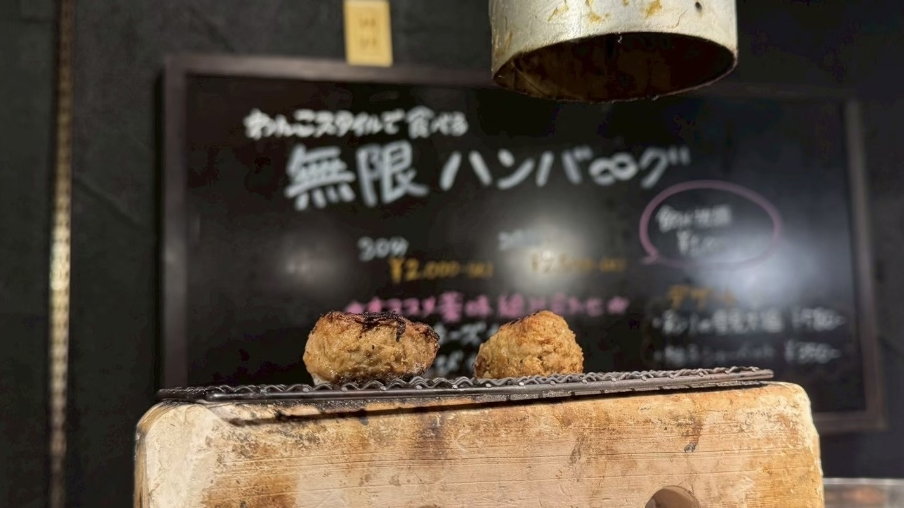
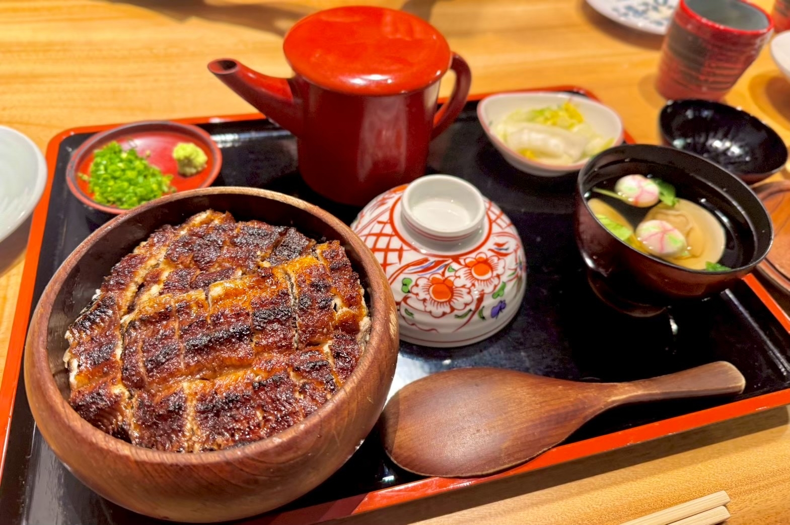
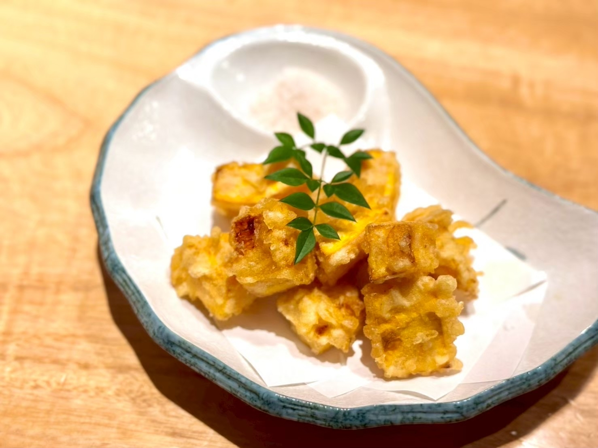

## 焼きたてハンバーグが次々登場！炭火で味わう無限ハンバーグ

大阪グルメ旅day3。\
ランチに訪れたのは「炭火焼き無限バーグ 無限」さんです。

こちらでは、炭火で焼き上げたハンバーグを、わんこそばのようなスタイルで次々と提供してくれます。\
今回は、一時間ハンバーグを楽しめるコースを注文しました。

店員さんが丁寧に焼き上げたハンバーグは、目の前にある網の上へ置いてくれます。\
そのまますぐに食べてもよし、もう少し香ばしくしたいときは、網の上で少し焼いてからいただくこともできます。

ハンバーグは小ぶりで食べやすく、お肉の存在感がしっかり感じられる味わい。\
炭火の香ばしい風味がまとっていて、熱々のまま食べられるのも嬉しいポイントです。

薬味やソースもいろいろ用意されていて、食べ方を変えながら楽しめました。\
卵と合わせたり、薬味をのせたりと組み合わせは豊富でしたが、個人的に一番好きだったのはケチャップです。

お肉らしい味わいのハンバーグに、ケチャップのほどよい酸味と甘みがよく合っていました。

食べ終わるころには、次のハンバーグが焼き上がって登場。\
最後まで熱々の状態で楽しめる、満足感たっぷりのランチでした。

===店舗情報===\
店名: 炭火焼き無限バーグ 無限\
リンク: [公式ウェブサイト](https://mugenhanbagu.owst.jp/)\
住所: 大阪府大阪市中央区難波千日前14-3

## 炭火の香ばしさとふっくら食感！うな富士の絶品ひつまぶし

大阪での観光を終えたあとは名古屋へ移動。\
夕食は「炭焼 うな富士 名駅店」さんへ訪れました。

注文したのは、たっぷりのうなぎが敷き詰められたひつまぶしです。\
運ばれてきた瞬間から、うなぎの香ばしい香りがふわっと広がります。

うなぎは表面が香ばしく焼き上げられていて、中はふっくらやわらか。\
甘めのたれがうなぎにもご飯にもしっかりとなじんでいて、ひと口目からおいしさが広がりました。

まずはそのままいただき、途中から薬味を合わせて味の変化を楽しみます。\
最後はお出汁を注いで、お茶漬けにしていただきました。

薬味とお出汁を加えることで、うなぎの濃い旨みが少しまろやかになり、最後までさっぱりと食べられます。\
個人的には、このお茶漬けでいただく食べ方が特に好みでした。

そして、もう一つ印象に残ったのが、宿儺南瓜の天ぷらです。

細長い形が特徴の宿儺南瓜が、食べやすい大きさに切られて揚げられています。\
衣の中はとてもなめらかで、かぼちゃとは思えないほど強い甘みがありました。

まるでスイーツを食べているような味わいで、添えられたお塩とも相性ぴったり。\
うなぎだけでなく、こちらの天ぷらも印象に残る一品でした。

ふっくらとしたうなぎから、最後のお茶漬けまで大満足。\
大阪グルメ旅の締めくくりにふさわしい、贅沢な夕食になりました。

===店舗情報===\
店名: 炭焼 うな富士 名駅店\
リンク: [公式ウェブサイト](https://sumiyaki-unafuji.com/shops/nagoya-ekimae/)\
住所: 愛知県名古屋市中村区名駅4-8-18 名古屋三井ビルディング北館 B1F
