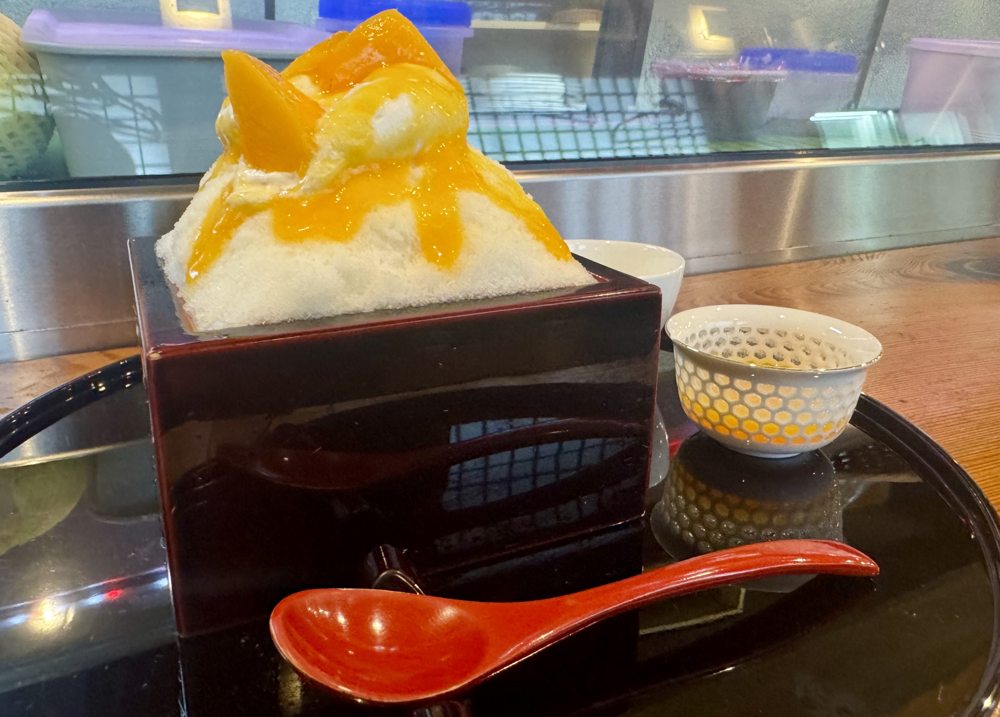
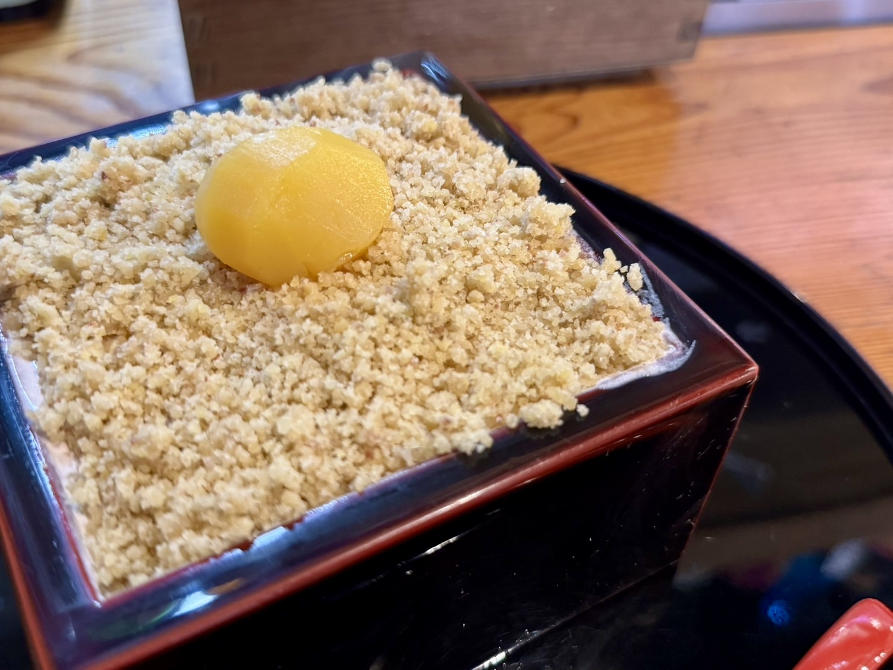
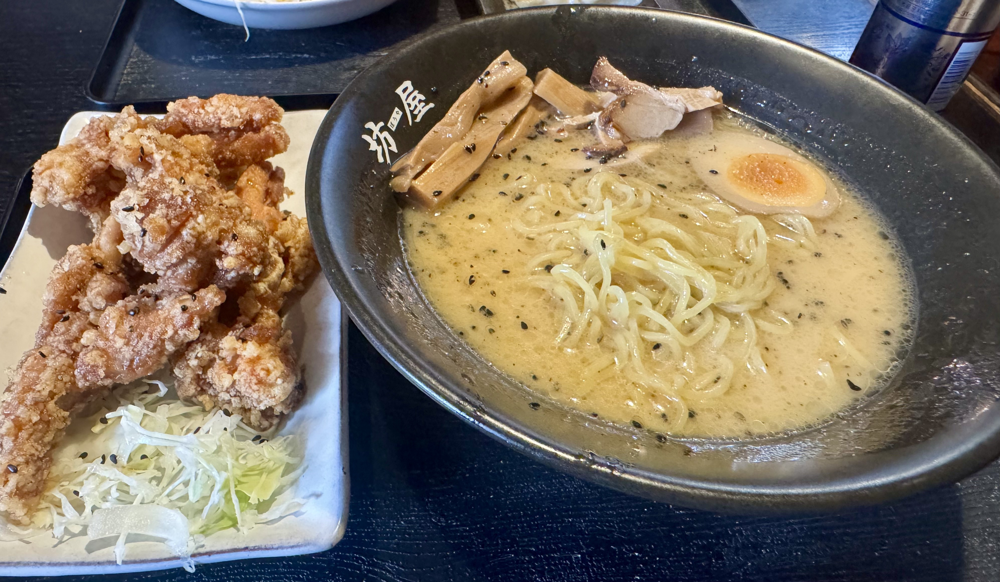
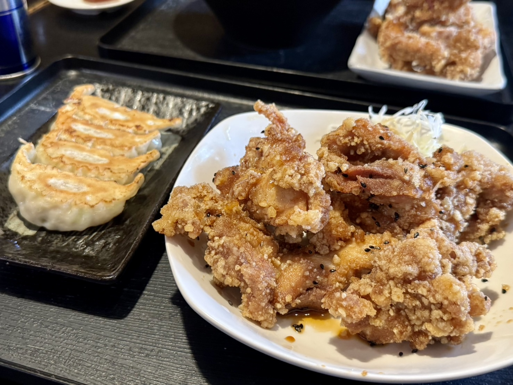

## 週末のかき氷とわらび餅！やきとり肥後

舞阪で訪れたのは「やきとり肥後」さん。\
夜は焼き鳥の居酒屋で、5月から9月の土日はかき氷も出しています。

いただいたのは、マンゴーをのせたかき氷です。\
ふわっと積んだ氷の上に、大きなマンゴーとソースがのっています！

もう一つは、栗のかき氷です。\
栗は上にのっているだけでなく、ふわふわな削り氷の下にもたくさん隠れていました。

===店舗情報===\
店名: やきとり肥後\
リンク: [Instagram](https://www.instagram.com/yakitori_higo/)\
住所: 静岡県浜松市中央区舞阪町舞阪2118-1-1

## 豚骨ラーメンと唐揚げの「坊屋」

続いて訪れたのは、舞阪のラーメン店「坊屋」さん。\
ラーメンの種類が多く、チャーハンとのセットも人気のお店です。
また、筆者が小学生の頃から通うお店でもあります。

こちらは、お上品な豚骨スープのラーメン。\
メンマ、チャーシュー、味玉がのっていて、黒ごまも散らしてあります。\
唐揚げも追加で注文しました✌︎

こちらは餃子と、もう一皿の唐揚げです。\
唐揚げは衣がカリカリで、黒ごまがふってあります。

===店舗情報===\
店名: 坊屋\
リンク: [ホットペッパーグルメ](https://www.hotpepper.jp/strJ000959655/)\
住所: 静岡県浜松市中央区馬郡町4162

どちらのお店もとてもオススメです！