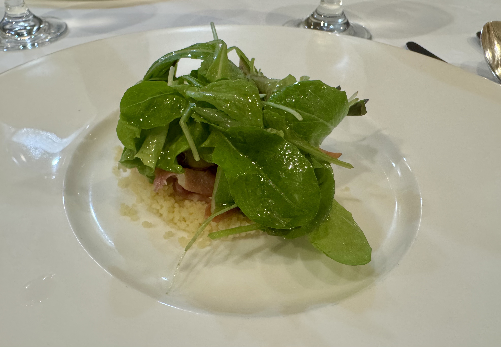
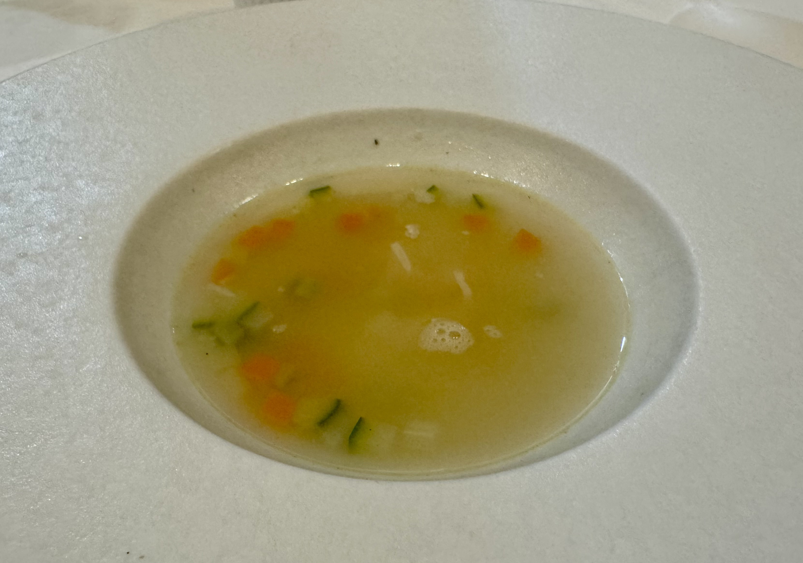
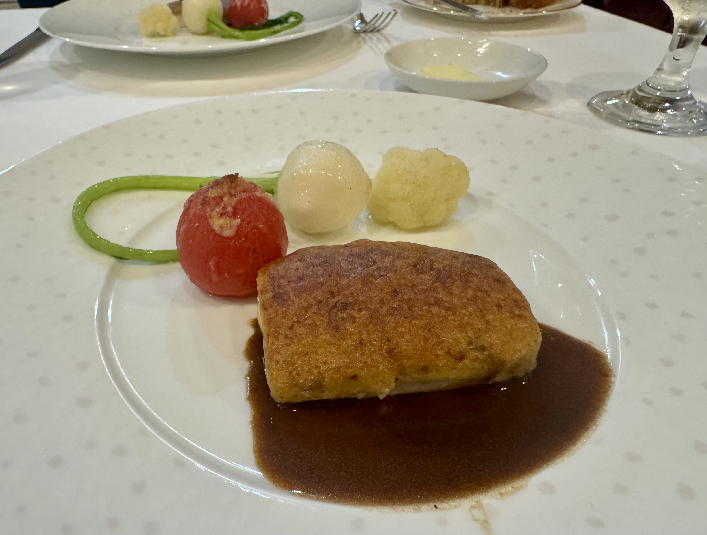
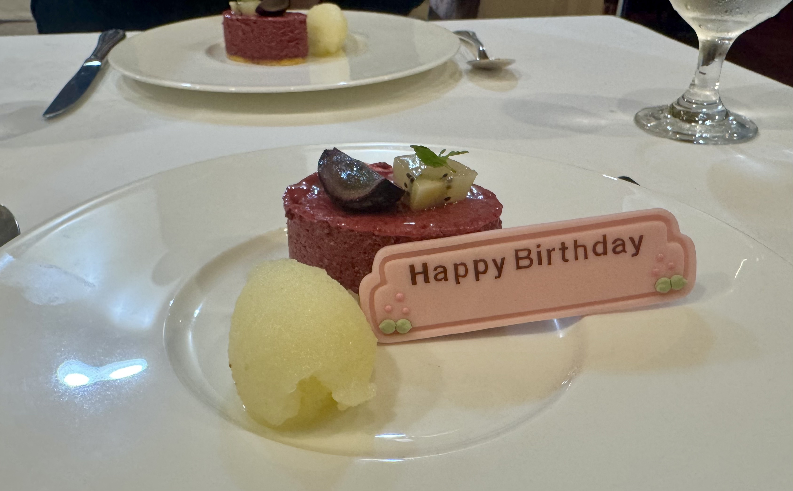

## 22歳と2週間と1日。フランス料理 タルタル

浜松駅から歩いてすぐの「フランス料理 タルタル」さんへ連れて行ってもらいました。\
筆者の誕生日は9月14日です。\
訪れたのは9月29日ですが、＋２週間と1日なのでお誕生日の範囲です！

まずは前菜にフォアグラです。\
ふぇ？フォアグラ！？ 初見さんです( ^ω^ )✌︎\
お上品な葉っぱの下に、きつね色のフォアグラと細かな粒々が隠れていました。

続いてスープ。\
チーズをたっぷり入れるもので、見た目はあっさりしているのに、野菜の旨みがすごいです。

メインは錦爽鶏。\
皮はカリカリで、中はふわふわ、ジューシーでしたわ（とてもお上品でありんす）。

締めは、りんごのジェラートとベリーのデザート。\
プレートには Happy Birthday の札まで立てていただきまして恐縮だﾖ。

非常に素晴らしき21歳から、これまた美しき22歳をお迎えできて、とても幸甚です。

あ、タルタルはみんな行くべきだぞ。
thx！

===店舗情報===\
店名: フランス料理 タルタル\
リンク: [しずおか食の情報センター](https://fujinokuni.shokunomiyako-shizuoka.pref.shizuoka.jp/restaurant/info/2268)\
住所: 静岡県浜松市中央区早馬町3-8
